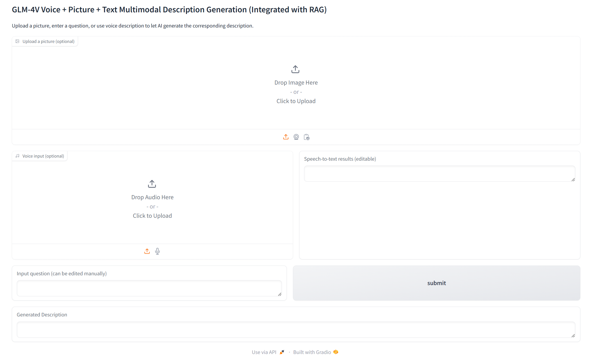
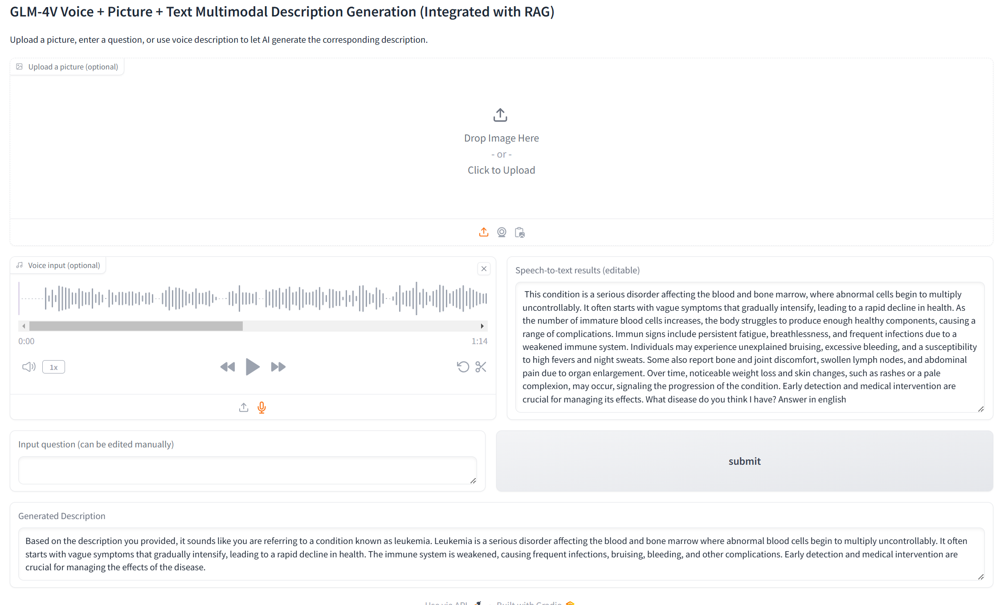
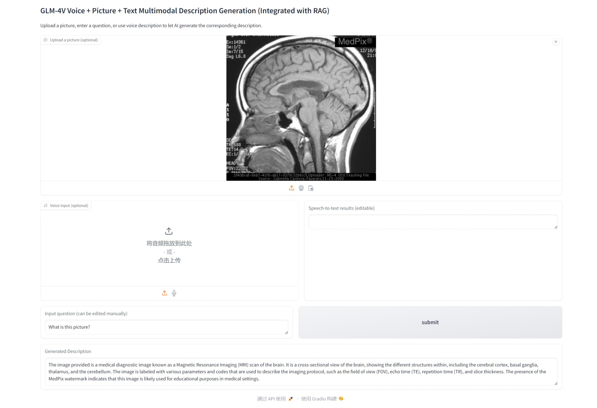

# HealthQA_base_MLLM
> This project is a senior course project of Ocean University of China and Heriot-Watt University. It aims to optimize the multimodal large language model in health and support tri-modal input of text, image and voice. In this experiment, we chose GLM-4V-9B, but it can be easily replaced with other models with better performance.

## 👥 Members
Yu Zhou, Xinyu Zhu, Yixing Zheng

## 🔥 Introduction
The core goals of this project are:
- 🌟 **Support multimodal input**: Combine **text, image, and voice** to improve medical Q&A results.
- 🚀 **Optimize based on GLM-4V-9B**: Train and deploy through **AutoDL vGPU-32GB**.
- 🔍 **Dataset**: Contains **text Q&A, image Q&A, and textbooks**, used to build the **RAG database**.

## 📂 Dataset-preparation
### 📥 Data preprocessing
We use Python to unify the data format for subsequent processing. The following are different databases and the formats they contain.
- **NHS dataset** 📜: Contains **Disease, Symptoms and Treatments** ([NHS website](https://www.nhsinform.scot/illnesses-and-conditions/a-to-z/))
- **Text question&answer and textbooks** 📜: Contains **type, question and answer** or **type and text** ([MedQA](https://github.com/jind11/MedQA))
- **Image question&answer** 📜: Contains **type, image, question and answer** ([VQA-Med-2019](https://github.com/abachaa/VQA-Med-2019))

## 🏗 MLLM-model-preparation
### 🌟 Custom knowledge base
Since we need to optimize health-related questions and answers, we choose to use RAG.
- For plain text embedding we choose to use all-MiniLM-L6-v2.([all-MiniLM-L6-v2](https://huggingface.co/sentence-transformers/all-MiniLM-L6-v2))
- For non-plain text embedding, we choose to use clip-vit-base-patch32.([clip-vit-base-patch32](https://huggingface.co/openai/clip-vit-base-patch32))
- The specific calling code for this case is:
  [Text_dataset_RAG_construction](directory/RAG_construction/Text_dataset_RAG_construction.ipynb)
  [NHS_dataset_RAG_construction](directory/RAG_construction/NHS_dataset_RAG_construction.ipynb)
  [Image_dataset_RAG_construction](directory/RAG_construction/Image_dataset_RAG_construction.ipynb)

### 📌 MLLM model selection
In order to achieve the tri-modal task goal, we investigated some multi-modal language models and finally decided to choose GLM-4V-9B after comparison.([GLM-4V-9B](https://github.com/THUDM/GLM-4))
- For the specific deployment process, please refer to the official website documentation.
- The calling method of this case:
  [Tri-modal_Before_optimization](directory/final_model/Tri-modal_Before_optimization.ipynb)
  [Trimodal_Optimized](directory/final_model/Trimodal_Optimized.ipynb)

### 🔊 Speech Recognition Model
We chose whisper to complete our speech recognition module.([whisper](https://github.com/openai/whisper))

## 📊 Experimental
After starting to run, the interface is as follows:

The result of voice input as an example:

Examples of using multimodal images:

## ✅ Evaluation
### 🎯 Accuracy
In order to verify the enhancement effect of RAG on clinical medical tasks, we evaluated it on the NHS case task. The results are shown in the following table:
| Model | Accuracy |
|----|----|
| Without RAG | 47.32% |
| With RAG | 75.12% |

The table above shows the accuracy comparison of the model before and after RAG, which clearly demonstrates the effectiveness of retrieval enhancement in the medical field.

### 🔬 Output Quality
To further evaluate the generation quality of the model on the NHS dataset, we analyzed it from two aspects:
- **Conciseness**: used to measure whether the generated content is more concise.
- **Medical Term Density (MTD)**: used to measure the medical relevance of the model's answers.
  
|  | Without RAG | With RAG | Change |
|----|----|----|----|
| Avg. Word Count | 156.55 | 142.24 | -9.14% |
| Medical Term Density | 0.0521 | 0.0585 | +12.38% |

Experimental results show that RAG makes the model's answers more refined and the model's output more specialized.

### 🔍 MMLU-Pro (Health) task evaluation
To verify the performance of the model on a more authoritative medical benchmark, we tested it on the MMLU-Pro (Health) dataset([MMLU-Pro](https://huggingface.co/datasets/TIGER-Lab/MMLU-Pro)):
- **Score**: Compare whether the model gets a higher score before and after adding RAG.
- **Effective answer**: Compare whether the model can generate more effective answers before and after adding RAG.

Specific evaluation code reference:
[evaluation_before_rag](directory/evaluation/evaluation_before_rag.ipynb)
[evaluation_after_rag](directory/evaluation/evaluation_after_rag.ipynb)

| Model | Accuracy |
|----|----|
| Without RAG | 31.42% |
| With RAG | 35.45% |

Although the increase is not as large as that of the NHS dataset, the nature of the MMLU-Pro task requires higher reasoning ability, so the result still shows that RAG has a certain enhancement effect.

|  | Without RAG | With RAG | Change |
|----|----|----|----|
| Null Responses | 146 | 47 | -67.8% |

The table above shows that RAG makes the model willing to answer in more cases. However, among the 99 null answers reduced, only 33 are correct at most, and the rest are still wrong, and may even affect the correct answers, indicating that RAG may encourage wrong answers in some cases.

### ⏳ Time
Although RAG introduces an additional retrieval process, its impact on response time is almost negligible. Experimental data on the NHS dataset show that:
- Without RAG, the average response time was 6.68 seconds.
- With RAG, the average response time was 6.66 seconds.

## 📌 Conclusion
This study evaluated the impact of RAG on a multimodal medical model (GLM-4V-9B as an example). The experimental results show that:
- RAG significantly improves the accuracy of the model on the NHS dataset (**+27.80%**).
- The output of the model is more concise (**-9.14%**) and more medically relevant (**+12.38%**) under the action of RAG.
- MMLU-Pro (Health) test shows that RAG still helps the model generalization ability (**+4.03%**), but further optimization is needed. RAG is effective in reducing null answers (**-67.8%**), but some newly generated answers are still wrong.
- RAG has **no significant impact on reasoning time**, making it still highly feasible in practice.

In the future, we plan to:
- Optimize the screening of RAG results, reduce the impact of irrelevant or misleading search content, and consider adding more datasets from different sources.
- Optimize the prompt design to improve the adaptability of the model to medical reasoning tasks.
- We have also added some questions and answers about medical imaging pictures in the dataset. Although these evaluations do not cover images, we will also give some examples and consider adding more pathological images for training in the future.
